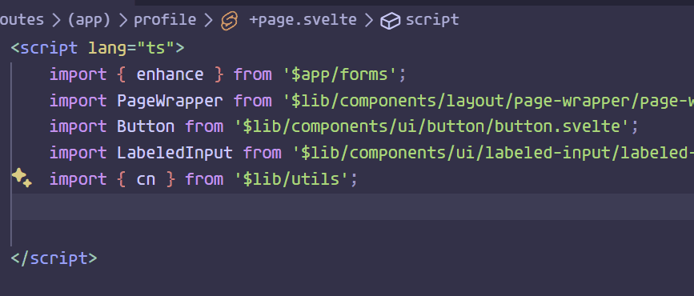
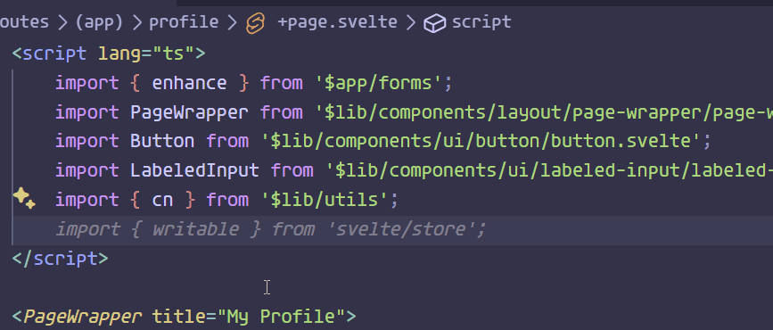

# Svelte Dot Runes

Enjoy writing out SvelteJS runes using dot notation.

## Features

Currently the `$state()` `$props()` and `$inspect()` runes are supported.

### `$props()`

To write a quick props rune simply type props.\<nameOfProp> followed by two spaces. You can chain as many props as you want together.

### `$state()`

To create state runes, write state.\<nameOfState> followed by two spaces. You can chain this together as many times as you want!

### `$inspect()`

You probably get the idea by now, just type inspect.\<nameOfVariable> followed by two spaces to generate an inspect rune with those variables inside of it!

## Requirements

There are no additional dependencies required to run this extension.

## Known Issues

- Currently when you generate the snippet, it does not indent. If you format on save this is not an issue.
- When using the inspect rune shortcut, it sometimes imports inspect from utils causing a conflict.

## Release Notes

Thanks for being an early adopter!

### 1.0.0

Initial release of `Svelte Dot Runes`

---

**Enjoy!**
